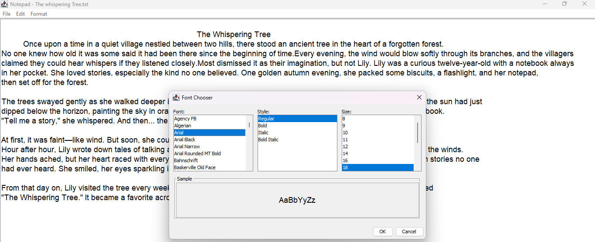

# 📝 Notepad Clone (Java + Swing)

A modern and feature-rich clone of the classic Windows Notepad, built using **Java** and **Swing**. This desktop application brings in a smooth, responsive, and visually appealing UI — enhanced with custom themes, icons, and animations.

---

## ✨ Features

- ✅ Create, open, edit, and save text files
- 📝 Supports `.txt`, `.md`, `.log`, and other plaintext formats
- 💾 Save As functionality with overwrite detection
- 🧠 Detects unsaved changes and prompts before closing
- 🖌️ Font customization (type, size, style)
- 🌗 Dark and Light mode toggle
- 🎨 Multiple theme support with a modern aesthetic
- 🔍 Find and Replace with regex support
- 🔄 Word and character count
- ⌨️ Keyboard shortcuts for quick actions
- 🪄 Smooth UI with polished buttons and transitions

---

## 📸 Screenshots



---

## 🛠️ Built With

- **Java 8+**
- **Java Swing** for UI
- **Custom Icons** (from FlatIcon/Icons8)
- **Custom Themes & Fonts**

---
## 🚀 Getting Started

### Requirements:
- Java JDK 8 or higher
- A Java IDE (like IntelliJ IDEA, Eclipse) or terminal with `javac` and `java`

### To Run:

```bash
# Clone the repository
git clone https://github.com/ellay21/Notepad.git
cd notepad-clone/src

# Compile
javac Notepad.java

# Run
java Notepad
You can also open the project in your favorite IDE and run Notepad.java as the entry point.

🎨 Customization
You can add new color themes in the UIManager.java file

Modify default font styles in TextAreaPanel.java

Icons can be replaced inside the assets/icons/ folder

🤝 Contributing
Pull requests are welcome! If you have suggestions for improvements, feel free to fork the repo and open a PR.

Steps to contribute:

Fork the project

Create a new branch (git checkout -b feature/your-feature)

Commit your changes (git commit -m 'Add feature')

Push to your fork (git push origin feature/your-feature)

Open a Pull Request

📃 License
This project is licensed under the MIT License – see the LICENSE file for details.

👨‍💻 Author
Made with ❤️ MESUD MELAKU ASFAW